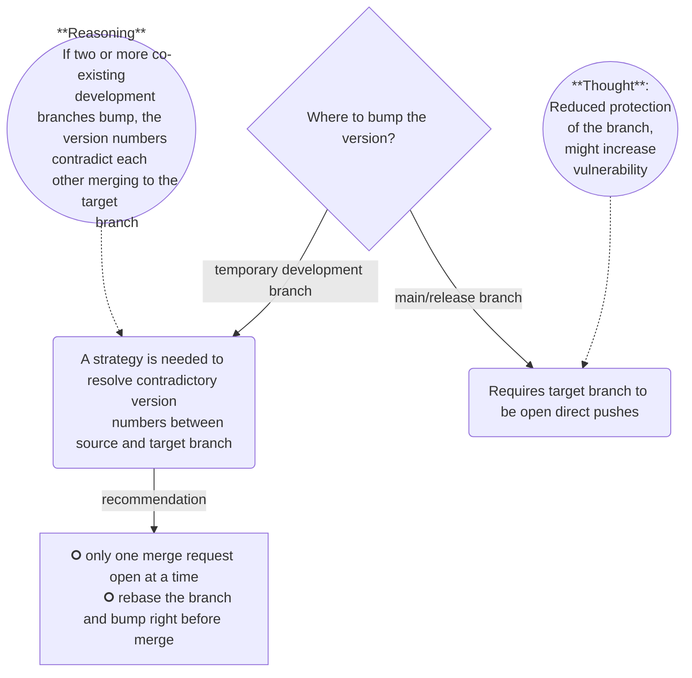

# Code Standards

A template for python projects.

It provides for example:
- A package management tool (`uv`)
- A linter and formatter with predefined rules (`ruff`)
- An initial Gitlab CI pipeline
- Tooling to generate documentation for your project
- A standard for logging

_Note: Currently Python versions 3.9, 3.11, and 3.12 are selectable when 
setting up your repo, 3.13 is not included for now, since many packages don't 
have wheels for it yet (2024/10/24)._ 

# Getting Started

This template is based on [copier](https://copier.readthedocs.io/en/stable/). See below how to use it:

## How to bootstrap a new project from this template

Prerequisites:
- You need to have access to the repository on gitlab and 
configure `git` in your shell to be able to as well.
- You need to have [`copier`](https://copier.readthedocs.io/en/stable/#installation) installed. We recommend using `uv` for this, 
  as you will need it when using the template anyway. If you don't have uv installed, see the [uv documentation](https://docs.astral.sh/uv/getting-started/installation/).
> 💡 **We currently use uv version 0.5.1** - you can specify the version with
> the download URL `https://astral.sh/uv/${UV_VERSION}/install.sh`

Install copier:
```bash
uv tool install copier@9.4.1  # Ensure you have copier installed.
```

Navigate to your project folder and initialise a new git repo:
```bash
git init
```

Initialise the project with copier:
```bash
copier copy https://github.com/Bundesdruckerei-GmbH/python-project-kickstarter.git .
```
Once this is done, follow the README in the new project to set up your 
development environment.

Notes: 
- If you haven't configured `git` to store your credentials, you might get
asked for them multiple times when running this command.
- If your repo has no git remote set, you should do that now (see [git 
  documentation](https://git-scm.com/docs/git-remote))


## Incorporate changes in the template into an existing project

Copier can detect changes made in the template repository after you
initialised a new project from it. So, if your project was initially
bootstrapped with copier you can then pull new changes in the template
repo into your own project by executing the following command from your
project repo:


```bash
copier update -a .copier-answers/python-project-kickstarter.yml  # Pull new changes.
```

## Creating a subtemplate

See [Creating a Subtemplate](./docs/sub-template.md)


# Conventional Commits

In order to have consistent version number generation and to reduce complexities in
regard to the version, dynamic versioning is recommended for the templated project. That 
means, that the version is not manually tracked and maintained, but calculated from the
commit history (i.e. commit messages).

The recommended CLI tooling for this is
[commitizen ('cz' command)](https://commitizen-tools.github.io/commitizen/) which eases
the versioning process with functionalities for conventional commit messages, version
management (bumping) and changelog creation. To install it, call
```bash
uv tool install commitizen
```
,which makes the CLI command `cz` available.


# Template Versioning Strategy

The provided template incorporates versioning using git tags as they are industry
standard and enable a variety of  tools supporting the project development and
lifecycle.

The template does not enforce a certain versioning strategy, but some aspects are
recommended at least to consider:

* [Conventional commits](https://www.conventionalcommits.org) help with creation of
  meaningful and consistent commit messages and enable dynamic version calculation (as
  opposed to manually tracking and deciding on a version number).
* Using [git tags](https://git-scm.com/book/en/v2/Git-Basics-Tagging) allows for easy
  tracking of versions. The template omits the 'v' prefix in the provided defaults, so a
  version tag will be in the form `/[0-9]+\.[0-9]+\.[0-9]+.*/`.

A strategy for **when** and **on which branch** to create a tag is explicitly not
advocated, because every strategy has its own advantages and drawbacks, which weigh
differently depending on team and context.

